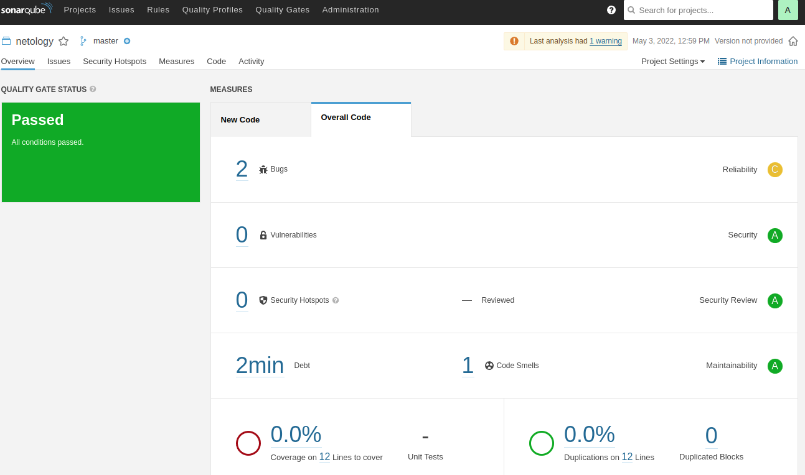
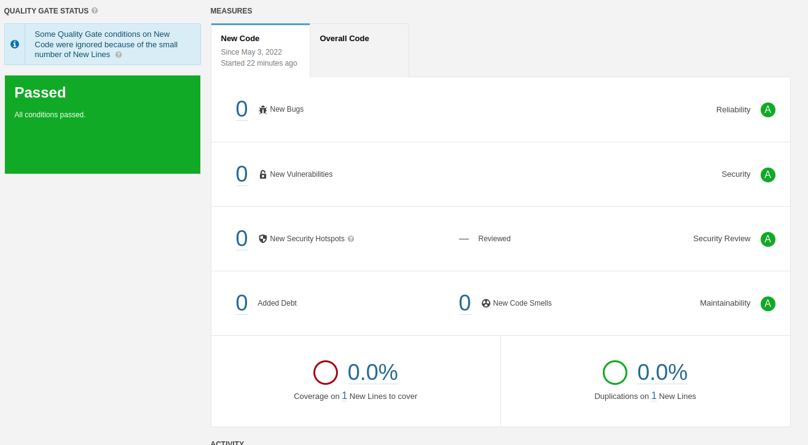
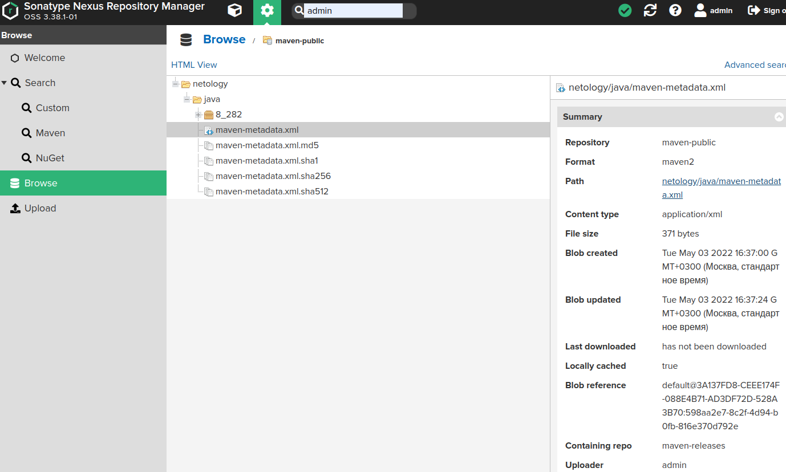

# Домашнее задание к занятию "09.02 CI\CD"

## Знакомоство с SonarQube

### Подготовка к выполнению

1. Выполняем `docker pull sonarqube:8.7-community`
2. Выполняем `docker run -d --name sonarqube -e SONAR_ES_BOOTSTRAP_CHECKS_DISABLE=true -p 9000:9000 sonarqube:8.7-community`
3. Ждём запуск, смотрим логи через `docker logs -f sonarqube`
4. Проверяем готовность сервиса через [браузер](http://localhost:9000)
5. Заходим под admin\admin, меняем пароль на свой

В целом, в [этой статье](https://docs.sonarqube.org/latest/setup/install-server/) описаны все варианты установки, включая и docker, но так как нам он нужен разово, то достаточно того набора действий, который я указал выше.

### Основная часть

1. Создаём новый проект, название произвольное
2. Скачиваем пакет sonar-scanner, который нам предлагает скачать сам sonarqube
3. Делаем так, чтобы binary был доступен через вызов в shell (или меняем переменную PATH или любой другой удобный вам способ)
4. Проверяем `sonar-scanner --version`
5. Запускаем анализатор против кода из директории [example](./example) с дополнительным ключом `-Dsonar.coverage.exclusions=fail.py`
6. Смотрим результат в интерфейсе
7. Исправляем ошибки, которые он выявил(включая warnings)
8. Запускаем анализатор повторно - проверяем, что QG пройдены успешно
9. Делаем скриншот успешного прохождения анализа, прикладываем к решению ДЗ

### Ответ:
```commandline
nariman@nariman:~/PycharmProjects/devops-netology$ docker run -d --name sonarqube -e SONAR_ES_BOOTSTRAP_CHECKS_DISABLE=true -p 9009:9000 sonarqube:8.7-community
Unable to find image 'sonarqube:8.7-community' locally
8.7-community: Pulling from library/sonarqube
22599d3e9e25: Pull complete 
00bb4d95f2aa: Pull complete 
3ef8cf8a60c8: Pull complete 
928990dd1bda: Pull complete 
07cca701c22e: Pull complete 
Digest: sha256:70496f44067bea15514f0a275ee898a7e4a3fedaaa6766e7874d24a39be336dc
Status: Downloaded newer image for sonarqube:8.7-community
2abbabd5be01f1c9265f7c423b8b106b100ad5da6aed38c55292605f031e3e4a
```

```commandline
nariman@nariman:~$ export PATH=/var/opt/sonar-scanner-4.7.0.2747-linux/bin:$PATH
nariman@nariman:~$ sonar-scanner --version
INFO: Scanner configuration file: /var/opt/sonar-scanner-4.7.0.2747-linux/conf/sonar-scanner.properties
INFO: Project root configuration file: NONE
INFO: SonarScanner 4.7.0.2747
INFO: Java 11.0.14.1 Eclipse Adoptium (64-bit)
INFO: Linux 5.13.0-40-generic amd64
```

```commandline
nariman@nariman:~/PycharmProjects/devops-netology/09-ci-02-cicd/example$ sonar-scanner   -Dsonar.projectKey=netology   -Dsonar.sources=.   -Dsonar.host.url=http://localhost:9009   -Dsonar.login=ac12abaa66bcebaf4dec96e46b3d9cc786775064
INFO: Scanner configuration file: /var/opt/sonar-scanner-4.7.0.2747-linux/conf/sonar-scanner.properties
INFO: Project root configuration file: /home/nariman/PycharmProjects/devops-netology/09-ci-02-cicd/example/sonar-project.properties
INFO: SonarScanner 4.7.0.2747
INFO: Java 11.0.14.1 Eclipse Adoptium (64-bit)
...
INFO: ANALYSIS SUCCESSFUL, you can browse http://localhost:9009/dashboard?id=netology
INFO: Note that you will be able to access the updated dashboard once the server has processed the submitted analysis report
INFO: More about the report processing at http://localhost:9009/api/ce/task?id=AYCJXCgAruMULN7jQijv
INFO: Analysis total time: 6.885 s
INFO: ------------------------------------------------------------------------
INFO: EXECUTION SUCCESS
INFO: ------------------------------------------------------------------------
INFO: Total time: 10.985s
INFO: Final Memory: 7M/40M
INFO: ------------------------------------------------------------------------
```


```commandline
nariman@nariman:~/PycharmProjects/devops-netology/09-ci-02-cicd/example$ sonar-scanner   -Dsonar.projectKey=netology   -Dsonar.sources=.   -Dsonar.host.url=http://localhost:9009   -Dsonar.login=ac12abaa66bcebaf4dec96e46b3d9cc786775064
INFO: Scanner configuration file: /var/opt/sonar-scanner-4.7.0.2747-linux/conf/sonar-scanner.properties
INFO: Project root configuration file: /home/nariman/PycharmProjects/devops-netology/09-ci-02-cicd/example/sonar-project.properties
INFO: SonarScanner 4.7.0.2747
...
INFO: ANALYSIS SUCCESSFUL, you can browse http://localhost:9009/dashboard?id=netology
INFO: Note that you will be able to access the updated dashboard once the server has processed the submitted analysis report
INFO: More about the report processing at http://localhost:9009/api/ce/task?id=AYCJb7ThruMULN7jQij0
INFO: Analysis total time: 5.188 s
INFO: ------------------------------------------------------------------------
INFO: EXECUTION SUCCESS
INFO: ------------------------------------------------------------------------
INFO: Total time: 5.832s
INFO: Final Memory: 70M/250M
INFO: ------------------------------------------------------------------------
```



## Знакомство с Nexus

### Подготовка к выполнению

1. Выполняем `docker pull sonatype/nexus3`
2. Выполняем `docker run -d -p 8081:8081 --name nexus sonatype/nexus3`
3. Ждём запуск, смотрим логи через `docker logs -f nexus`
4. Проверяем готовность сервиса через [бразуер](http://localhost:8081)
5. Узнаём пароль от admin через `docker exec -it nexus /bin/bash`
6. Подключаемся под админом, меняем пароль, сохраняем анонимный доступ

### Основная часть

1. В репозиторий `maven-public` загружаем артефакт с GAV параметрами:
   1. groupId: netology
   2. artifactId: java
   3. version: 8_282
   4. classifier: distrib
   5. type: tar.gz
2. В него же загружаем такой же артефакт, но с version: 8_102
3. Проверяем, что все файлы загрузились успешно
4. В ответе присылаем файл `maven-metadata.xml` для этого артефекта

### Ответ:

```commandline
nariman@nariman:~/PycharmProjects/devops-netology$ docker run -d -p 8088:8081 --name nexus sonatype/nexus3
263a06df54c955d8a785d537059af928c7be7053525951b4dafb08e4892960af
nariman@nariman:~/PycharmProjects/devops-netology$ docker logs -f nexus
```

```commandline
bash-4.4$ cd nexus-data/
bash-4.4$ ls
admin.password  blobs  cache  db  elasticsearch  etc  generated-bundles  instances  javaprefs  karaf.pid  keystores  lock  log  orient  port  restore-from-backup  tmp
bash-4.4$ cat admin.password 
```

```commandline
<?xml version="1.0" encoding="UTF-8"?>
<metadata modelVersion="1.1.0">
  <groupId>netology</groupId>
  <artifactId>java</artifactId>
  <versioning>
    <latest>8_282</latest>
    <release>8_282</release>
    <versions>
      <version>8_282</version>
    </versions>
    <lastUpdated>20220503134552</lastUpdated>
  </versioning>
</metadata>
```

### Знакомство с Maven

### Подготовка к выполнению

1. Скачиваем дистрибутив с [maven](https://maven.apache.org/download.cgi)
2. Разархивируем, делаем так, чтобы binary был доступен через вызов в shell (или меняем переменную PATH или любой другой удобный вам способ)
3. Проверяем `mvn --version`
4. Забираем директорию [mvn](./mvn) с pom

### Основная часть

1. Меняем в `pom.xml` блок с зависимостями под наш артефакт из первого пункта задания для Nexus (java с версией 8_282)
2. Запускаем команду `mvn package` в директории с `pom.xml`, ожидаем успешного окончания
3. Проверяем директорию `~/.m2/repository/`, находим наш артефакт
4. В ответе присылаем исправленный файл `pom.xml`

### Ответ:
```commandline
nariman@nariman:/var/opt/apache-maven-3.8.5/bin$ mvn -version
Apache Maven 3.6.3
Maven home: /usr/share/maven
Java version: 11.0.15, vendor: Private Build, runtime: /usr/lib/jvm/java-11-openjdk-amd64
Default locale: ru_RU, platform encoding: UTF-8
OS name: "linux", version: "5.13.0-40-generic", arch: "amd64", family: "unix"
```

```commandline
nariman@nariman:~/PycharmProjects/devops-netology/09-ci-02-cicd/mvn$ mvn package
WARNING: An illegal reflective access operation has occurred
WARNING: Illegal reflective access by com.google.inject.internal.cglib.core.$ReflectUtils$1 (file:/usr/share/maven/lib/guice.jar) to method java.lang.ClassLoader.defineClass(java.lang.String,byte[],int,int,java.security.ProtectionDomain)
WARNING: Please consider reporting this to the maintainers of com.google.inject.internal.cglib.core.$ReflectUtils$1
WARNING: Use --illegal-access=warn to enable warnings of further illegal reflective access operations
WARNING: All illegal access operations will be denied in a future release
[INFO] Scanning for projects...
[INFO] 
[INFO] --------------------< com.netology.app:simple-app >---------------------
[INFO] Building simple-app 1.0-SNAPSHOT
[INFO] --------------------------------[ jar ]---------------------------------
Downloading from central: https://repo.maven.apache.org/maven2/org/apache/maven/plugins/maven-resources-plugin/2.6/maven-resources-plugin-2.6.pom
Downloaded from central: https://repo.maven.apache.org/maven2/org/apache/maven/plugins/maven-resources-plugin/2.6/maven-resources-plugin-2.6.pom (8.1 kB at 6.5 kB/s)
Downloading from central: https://repo.maven.apache.org/maven2/org/apache/maven/plugins/maven-plugins/23/maven-plugins-23.pom
...
[WARNING] JAR will be empty - no content was marked for inclusion!
[INFO] Building jar: /home/nariman/PycharmProjects/devops-netology/09-ci-02-cicd/mvn/target/simple-app-1.0-SNAPSHOT.jar
[INFO] ------------------------------------------------------------------------
[INFO] BUILD SUCCESS
[INFO] ------------------------------------------------------------------------
[INFO] Total time:  37.480 s
[INFO] Finished at: 2022-05-03T17:16:25+03:00
[INFO] ------------------------------------------------------------------------
```

```commandline
<project xmlns="http://maven.apache.org/POM/4.0.0" xmlns:xsi="http://www.w3.org/2001/XMLSchema-instance"
  xsi:schemaLocation="http://maven.apache.org/POM/4.0.0 http://maven.apache.org/xsd/maven-4.0.0.xsd">
  <modelVersion>4.0.0</modelVersion>

  <groupId>com.netology.app</groupId>
  <artifactId>simple-app</artifactId>
  <version>1.0-SNAPSHOT</version>
   <repositories>
    <repository>
      <id>my-repo</id>
      <name>maven-public</name>
      <url>http://localhost:8088/repository/maven-public/</url>
    </repository>
  </repositories>
  <dependencies>
    <dependency>
      <groupId>netology</groupId>
      <artifactId>java</artifactId>
      <version>8_282</version>
      <classifier>distrib</classifier>
      <type>tar.gz</type>
    </dependency>
  </dependencies>
</project>
```

